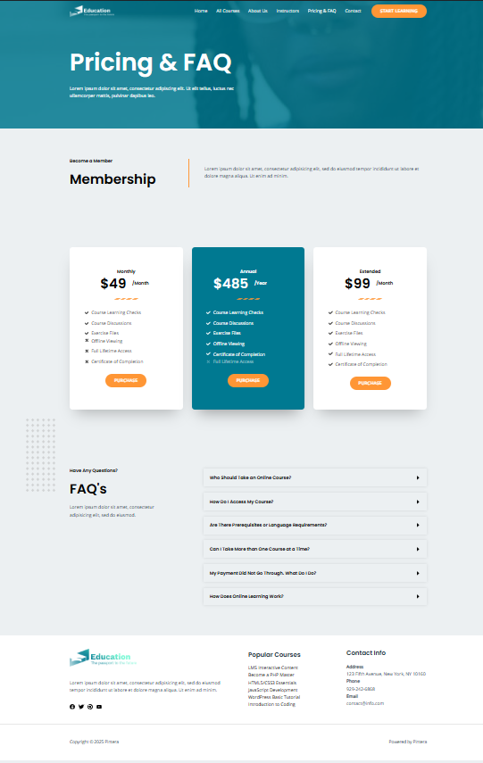
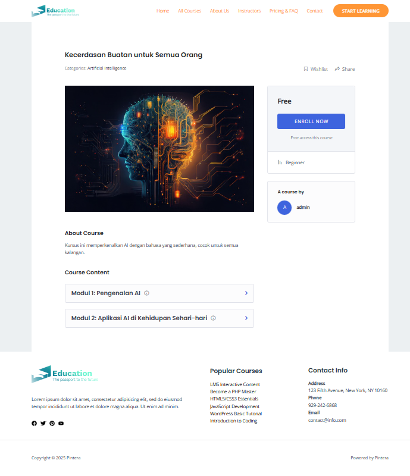
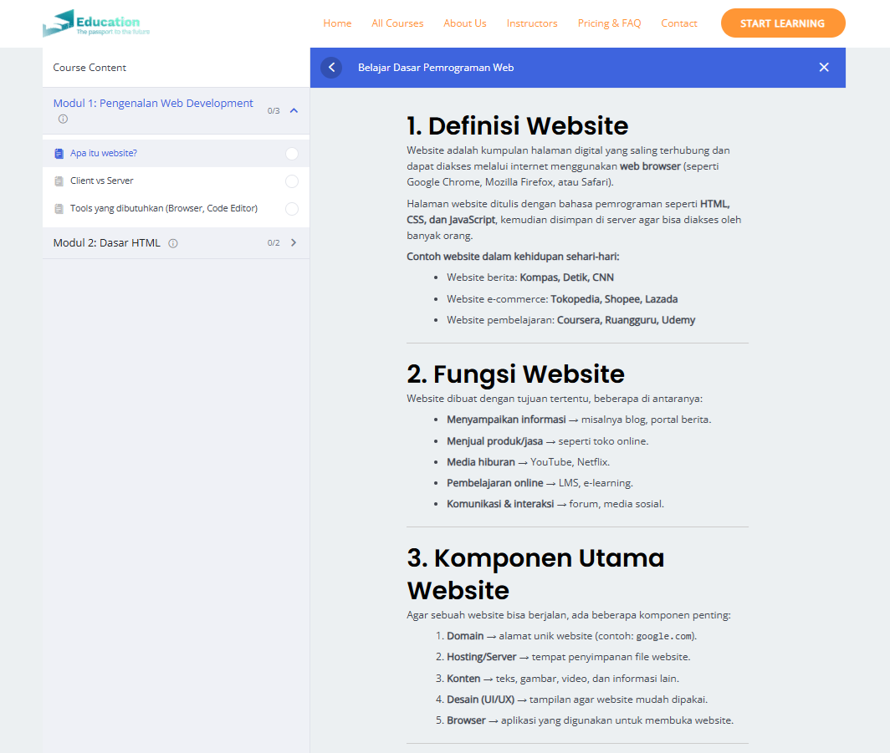

# Pintera - WordPress LMS Project

**Pintera** is a simple **Learning Management System (LMS)** built with **WordPress**.  
The goal of this project is to provide an easy-to-use and customizable e-learning platform.

---

## Features
- **Course Management** – Create, organize, and display online courses.
- **Student Management** – Registration, login, and progress tracking.
- **Instructor Management** – Instructor profiles and course settings.
- **Quizzes & Exams** – Build interactive quizzes for student assessments.
- **Payments & Monetization** – Integration with payment gateways.
- **Reports & Analytics** – Track student progress and course performance.

---

## Tech Stack
- **WordPress** (core CMS)
- **MySQL** (database)
- **PHP 8+** (compatibility)

---

## Plugins Used
- **TutorLMS** – LMS core functionality (courses, lessons, quizzes).  
- **WooCommerce** – Payment integration.  
- **Elementor** – Page builder for custom layouts.  
- **Contact Form 7** – Simple contact form management.  
- **Yoast SEO** – SEO optimization.  
- **WP Super Cache** – Performance and caching.  
- **User Registration** – Extended registration forms.  

---

## Installation
1. Clone this repository:
   ```bash
      git clone https://github.com/robbynurdiansyah/wordpress-lms.git
   ```
2. Set up a local server (XAMPP, Laragon, or Docker).
3. Import the database (if provided) to MySQL.
4. Configure wp-config.php with your database credentials.
5. Run the project locally:
   ```bash
     http://localhost/wordpress-lms
   ```
---

## Preview

#### Homepage


#### All Courses


#### About Us


#### Contact Us


#### Instructors


#### Pricing and FAQ


#### Course Detail


#### Course Content


---

## Author

Robby Bambang Nurdiansyah

Web Developer | QA Engineer | n8n Automation
